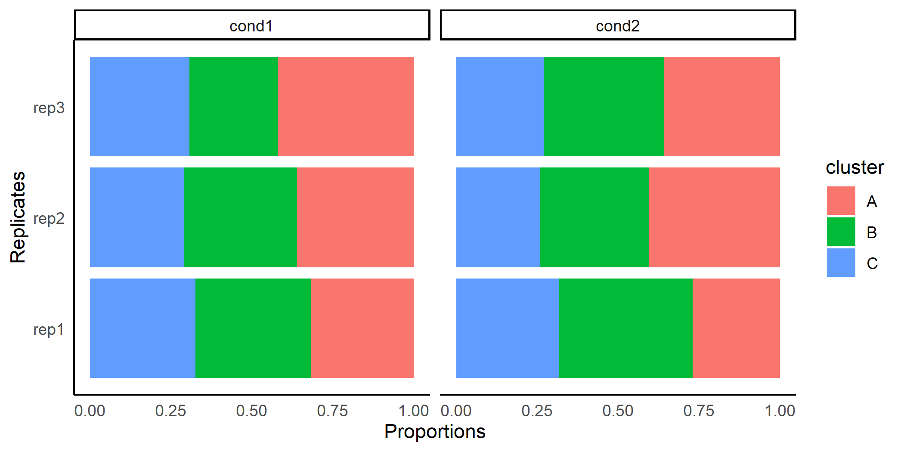
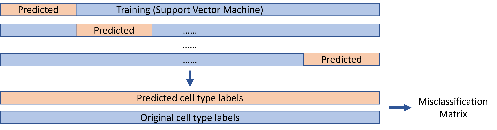

background-image: url("./image/hku2.jpg")
background-position: bottom left
background-size: 150px 30px
layout: true

<style type="text/css">
.remark-slide-content {
    font-size: 17px;
    padding: 1em 4em 1em 4em;
}
</style>

---

# Motivation

* R package designed for differential composition analysis on single cell data

* Basic assumptions

  + cell counts follow beta-binomial distribution

  + misclassification error exists

```{r, out.width='90%', fig.align='center',echo=FALSE}

```

---

# Workflow

<br/>

```{r, out.width='100%', fig.align='center', echo=FALSE}
knitr::include_graphics('./image/LM0510/overall.png')
```

---

# Workflow

<br/>

```{r, out.width='100%', fig.align='center', echo=FALSE}

```

---

# Method: Misclassification Correction

* Uniform type: 

\begin{bmatrix}
    a       & (1-a)/(K-1) & \dots & (1-a)/(K-1) \\
    (1-a)/(K-1)  &   a & \dots & (1-a)/(K-1) \\
    \vdots & \vdots & \ddots & \vdots \\
    (1-a)/(K-1)  &   (1-a)/(K-1) & \dots & a
\end{bmatrix}

<br/>

* KNN type: $m_{ij}$ = % of cluster $i$'s neighborhoods $\in$ cluster $j$

<br/>

* SVM type: 

```{r, out.width='90%', fig.align='center',echo=FALSE}

```

---

# Method: Models Selection

* Type 1: Null model

Model 0: $g(\bar y) = \beta_0$

Model 1: $g(\bar y) = \beta_0 + \beta_1*tested\_covariate$

<br/>

* Type 2: Full model

Model 0: $g(\bar y) = \beta_0 + \beta*other\_covariates$

Model 1: $g(\bar y) = \beta_0 + \beta*other\_covariates + \beta_i*tested\_covariate$

```{r, echo=FALSE, warning=FALSE, message=FALSE}
library(DCATS)
library(tidyverse)
data("Ren2021")
Ren2021$designM %>% 
  dplyr::rename(condition = state) %>% 
  head() %>% 
  knitr::kable(format = 'html')
```


---

# Method: Determine Over-dispersion

* Numbers of cells follow beta-binomial distribution:
   
$$P(Y=y|n,p) = \left(\begin{array}{c}n \\y \end{array} \right) = p^y(1-p)^{n-y}$$
$$f(p|a,b) = \frac{1}{B(a,b)}p^{a-1}(1-p)^{b-1}$$
$$E(Y|n,\pi,\phi) = n\pi, Var(Y|n,\pi,\phi) = n\pi(1-\pi)[1+(n-1)\times\phi]$$

<br/>

* Without fixed over-dispersion term : 

   + $\phi$ is estimated in each beta-binomial GLM for each cell type
   
<br/>

* With fixed over-dispersion term : 

   + $\phi$ is estimated across all cell types before testing
   
   + is given in each beta-binomial GLM for each cell type


---

# How to use DCATS

* **Count Matrix**

```{r}
library(DCATS)
data("Haber2017")
rbind(Haber2017$count_ctrl, Haber2017$count_Hpoly3)
```

---

# How to use DCATS

* **Design Matrix**

```{r}
sim_design = data.frame(condition = c("control", "control", "control", "control", "Hpoly3", "Hpoly3"))
print(sim_design)
```

---

# How to use DCATS

* **Design Matrix**

```{r}
data("Ren2021")
print(head(Ren2021$designM, 10))
```

---

# How to use DCATS

* **Misclassification Matrix (a K $\times$ K matrix)**

```{r, eval=FALSE}
Haber2017$svm_mat
```

<br/>

```{r, out.width='100%', fig.align='center',echo=FALSE}
knitr::include_graphics('./image/BioC_Asia/svm_mat.png')
```

---

# How to use DCATS

* **Misclassification Matrix**

```{r, eval=FALSE}
data("Kang2017")
data("simulation")

# Three ways to calculate similarity matrices
## Uniform type
simil_mat = create_simMat(K = 3, confuse_rate = 0.2)

## KNN type
knn_mat = knn_simMat(KNN_matrix = simulation$knnGraphs, clusters = simulation$labels)

## SVM type
svm_mat = svm_simMat(dataframe = Kang2017$svmDF)
```

---

# How to use DCATS

* **Main Function**

```{r, echo=FALSE}
set.seed(6171)
K <- 3
totals1 = c(100, 800, 1300, 600)
totals2 = c(250, 700, 1100)
diri_s1 = rep(1, K) * 20
diri_s2 = rep(1, K) * 20
simil_mat = create_simMat(K, confuse_rate=0.2)
sim_dat <- DCATS::simulator_base(totals1, totals2, diri_s1, diri_s2, simil_mat)
sim_count = rbind(sim_dat$numb_cond1, sim_dat$numb_cond2)
sim_design = data.frame(condition = c("g1", "g1", "g1", "g1", "g2", "g2", "g2"), 
                        gender = sample(c("Female", "Male"), 7, replace = TRUE))
```

.pull-left[
```{r}
print(sim_count)
```

]
.pull-right[
```{r}
print(sim_design)
```
]

```{r, eval=FALSE}
## null model, flexible phi
res = dcats_GLM(sim_count, sim_design, similarity_mat = simil_mat)
## full model, flexible phi
res = dcats_GLM(sim_count, sim_design, simil_mat, base_model='FULL')
## null model, fixed phi
phi = getPhi(sim_count, sim_design)
res = dcats_GLM(sim_count, sim_design, simil_mat, fix_phi = phi)
```

---

# How to use DCATS

* **Main Function**

```{r}
res = dcats_GLM(sim_count, sim_design, similarity_mat = simil_mat)
print(res$LRT_pvals)
```


---

# Method: Simulation Design

<br/>
<br/>

```{r, out.width='100%', fig.align='center',echo=FALSE}

```

---

# Results: Simulation

* **Theoretical Simulation**

<br/>

```{r, out.width='100%', fig.align='center',echo=FALSE}

```

---

# Results: Simulation

* **Simulation with Expression Info**

<br/>

```{r, out.width='100%', fig.align='center',echo=FALSE}

```

---

# Results: Simulation

* **Simulation with Covariates**

```{r, out.width='100%', fig.align='center',echo=FALSE}
knitr::include_graphics('./image/BioC_Asia/Fig1_C.png')
```

---

# Results: Real World Data

```{r, out.width='75%', fig.align='center',echo=FALSE}

```

---

# Results: Real World Data

<br/>

```{r, out.width='90%', fig.align='center',echo=FALSE}
knitr::include_graphics('./image/BioC_Asia/Fig2_E.png')
```

---

class: center, middle

<font size="10">Thanks</font>
<br/>
<br/>
<br/>
<br/>
<font size="10">Q&A</font>

---

# References

```{r, load_refs, echo=FALSE,message=FALSE}
library(RefManageR)
bib <- ReadBib("./bibFiles/BioC_Asia.bib", check = FALSE)
```

```{r, print_refs, results='asis', echo=FALSE, warning=FALSE, message=FALSE}
print(bib, 
  .opts = list(check.entries = FALSE, sorting = "none"))
```

