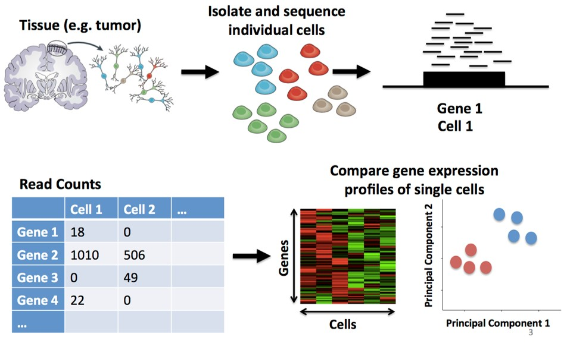

# RNA sequencing(RNA-seq)

```{r, out.width='100%', fig.align='center', echo=FALSE}
knitr::include_graphics('./image/MMPH6140/RNAseq.png')
```

---

# Single-cell RNA sequencing(scRNA-seq)

```{r, out.width='100%', fig.align='center', echo=FALSE}

```

---

# Expression intra-tumor heterogeneity (eITH)

* caused by genomic instability

*  governs many critical facets of tumor biology

  + tumor progression
  
  + metastasis
  
  + resistance to treatment

* driven by subsets of tumor cells -> crucial to learn single cell level genomic information


---

# 

---

# References

```{r, load_refs, echo=FALSE,message=FALSE}
library(RefManageR)
bib <- ReadBib("./bibFiles/mmph6140.bib", check = FALSE)
```

```{r, print_refs, results='asis', echo=FALSE, warning=FALSE, message=FALSE}
print(bib, 
  .opts = list(check.entries = FALSE, sorting = "none"))
```