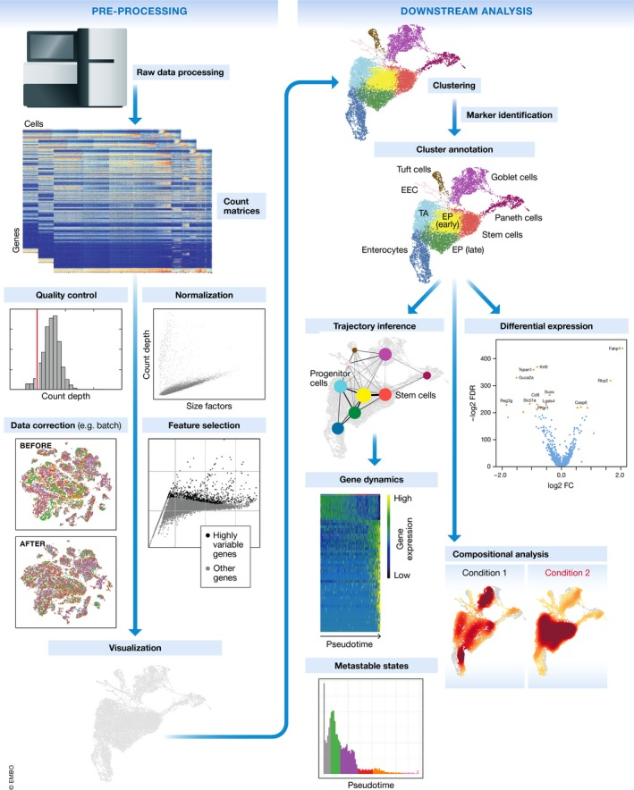
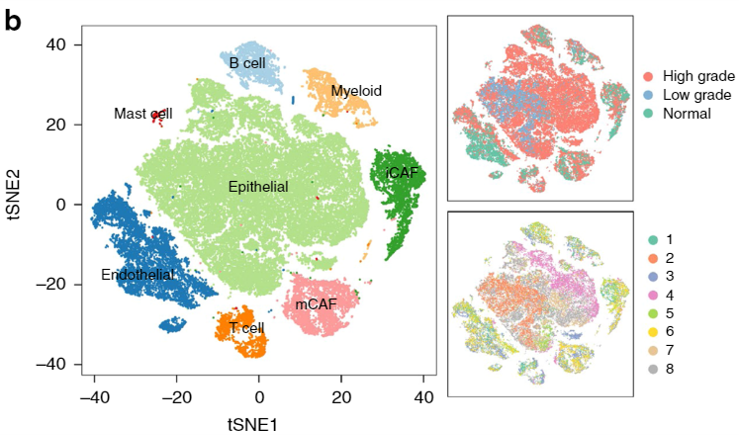
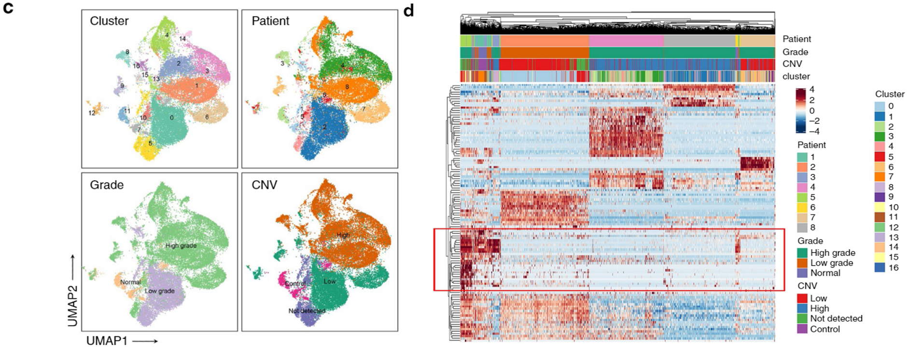
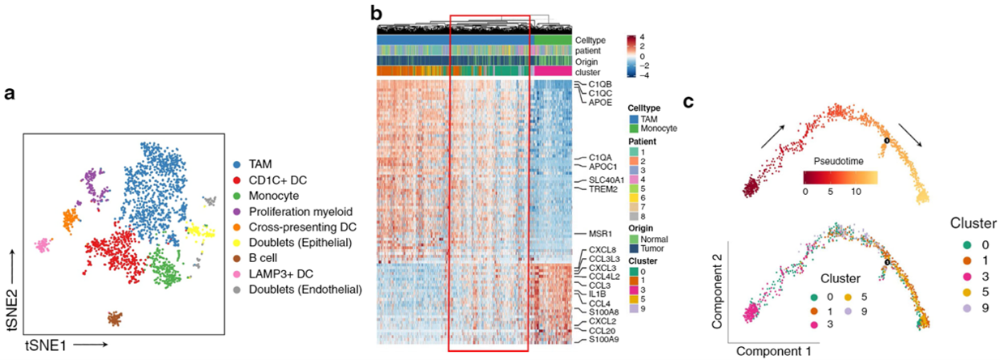
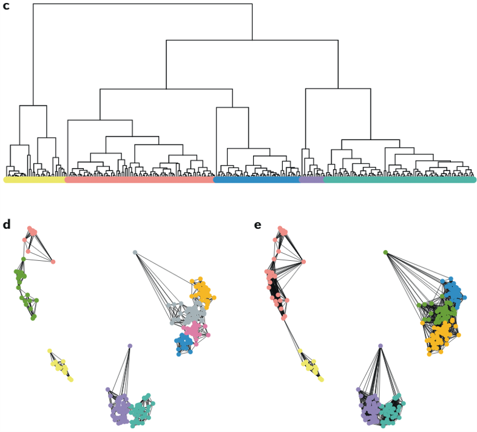
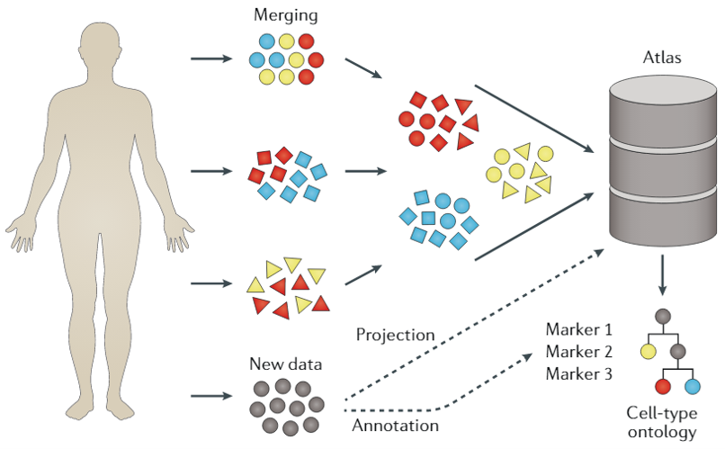

# RNA Sequencing(RNA-seq)

```{r, out.width='100%', fig.align='center', echo=FALSE}
knitr::include_graphics('./image/MMPH6140/RNAseq.png')
```

---

# Single-cell RNA Sequencing(scRNA-seq)

```{r, out.width='100%', fig.align='center', echo=FALSE}
knitr::include_graphics('./image/RPG_discussion/workflow.jpg')
```

---

# Expression Intra-tumor Heterogeneity (eITH)

* caused by genomic instability

*  governs many critical facets of tumor biology

  + tumor progression
  
  + metastasis
  
  + resistance to treatment

* driven by subsets of tumor cells -> crucial to learn single cell level genomic information

---

# Bioinformatics Analysis

```{r, out.width='55%', fig.align='center', echo=FALSE}

```

---

# Example: bladder urothelial carcinoma(BC)

* one of the most prevalent urogenital malignant disease

* healthy cells(urothelial cells) in the bladder lining change and grow out of control

* designing new treatment strategies for BC is challenging

  + one of the least immune infiltrated cancers 
  
  + poor response to anti-PD1 therapy

---

# Example: bladder urothelial carcinoma[4]

* overall

* 2 low-grade bladder urothelial tumors; 6 high-grade bladder urothelial tumors; 3 adjacent normal mucosae

* iCAFs: inflammatory cancer-associated fibroblasts; mCAF: myo-CAFs

```{r, out.width='80%', fig.align='center', echo=FALSE}

```

---

# Example: bladder urothelial carcinoma[4]

* EPCAM+ epithelial cells(EPCs)

* CNVs accumulated in most high-grade tumor-derived EPCs

* showed high heterogeneity among clusters

* some cells from tumor tissue possessed almost no CNV and showed a similar expression pattern to normal EPCs -> non-malignant EPCs.

```{r, out.width='100%', fig.align='center', echo=FALSE}

```

---

# Example: bladder urothelial carcinoma[4]

* myeloid cells

* monocytes recruited into the tumor region were reprogrammed into tumor-associated macrophages(TAMs)
  + monocytes mostly originated from normal mucosal tissues, while TAMs were enriched in BC tissues
  + the transcriptomes of these two cell types exhibited continual changes
  + confirmed by trajectory analysis

```{r, out.width='100%', fig.align='center', echo=FALSE}

```

---

class: center, middle

## Thanks!

---

# References

```{r, load_refs, echo=FALSE,message=FALSE}
library(RefManageR)
bib <- ReadBib("./bibFiles/mmph6140.bib", check = FALSE)
```

```{r, print_refs, results='asis', echo=FALSE, warning=FALSE, message=FALSE}
print(bib, 
  .opts = list(check.entries = FALSE, sorting = "none"))
```

---

# Bioinformatics Analysis: clustering

```{r, out.width='65%', fig.align='center', echo=FALSE}

```

.footnote["Challenges in unsupervised clustering of single-cell RNA-seq data."]
---

# Bioinformatics Analysis: clustering

```{r, out.width='90%', fig.align='center', echo=FALSE}

```

.footnote["Challenges in unsupervised clustering of single-cell RNA-seq data."]