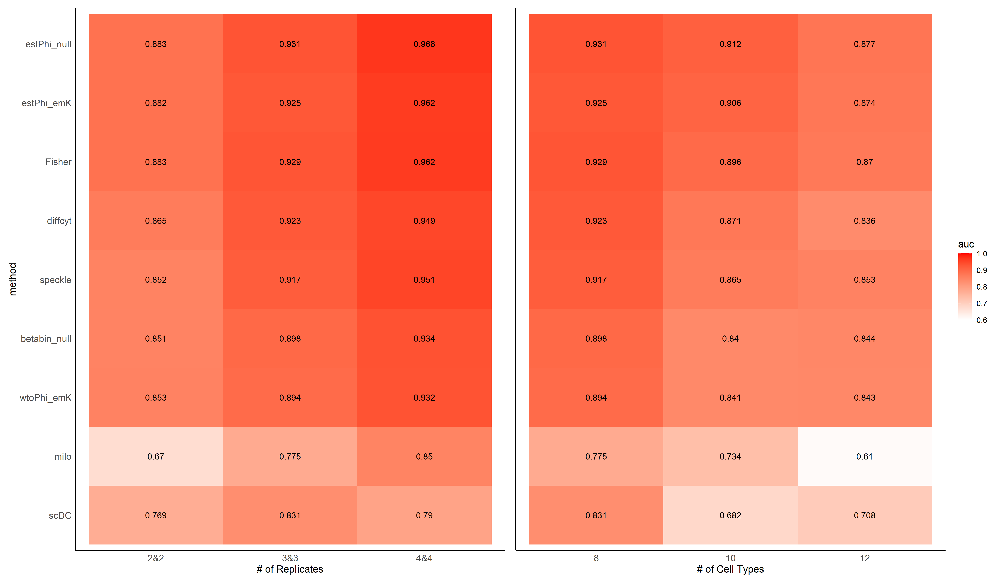
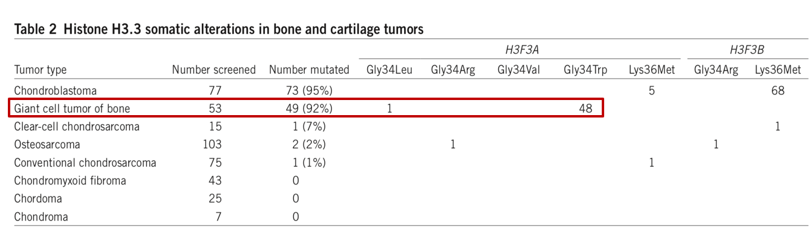

<style>
p.caption {
  font-size: 0.8em;
}
</style>

# Background & Research Goals

* Challenges on single cell data analysis

  + lack of accurate cell clustering method
  
  + hard to observe dynamic changes on different cell types

  + inaccurate trajectory analysis

  + needs of computational tools for different data types analysis
  
* PhD focus

  statistical analysis for scalable single cell analysis
  
  + single cell data analysis
  
  + statistical modeling
  
---

# DCATS: Background

* Tissues are cellular heterogeneity

* Composition difference exists

* Interested in changes of proportions in dynamic process

```{r, out.height='10%', fig.align='center',echo=FALSE}
knitr::include_graphics('./image/RPG_discussion/dcats_background.png')
```

---

# DCATS: Design

* R package designed for differential composition analysis on single cell data

* Basic assumptions

  + misclassification error exists

  + cell counts follow binomial distribution
  
* Input

  + cell counts matrices of samples coming from different conditions
  
  + a confusion matrix describing the misclassification error(user-input or calculated by DCATS)

---

# DCATS: Theoretical Simulation

* Given a similarity matrix, only simulate cell count matrices

* For each replicates:

$$(p_1, p_2, p_3) \sim Dir(\alpha_1, \alpha_2, \alpha_3)$$

$$(c_1, c_2, c_3) \sim multinomial(p_1,p_2,p_3|M_{sim})$$
* Result

```{r, out.width='55%', fig.align='center', echo=FALSE}
#knitr::include_graphics(c('./image/RPG_discussion/test.png', './image/RPG_discussion/dcats_result1.png'))

```

---

# DCATS: Simulation with Gene Expression Information

* Simulation process 

```{r, out.width='90%', fig.align='center',echo=FALSE}

```

---

# DCATS: Simulation with Gene Expression Information

* Simulation results

```{r, out.width='100%', fig.align='center',echo=FALSE}
knitr::include_graphics('./image/RPG_discussion/dcats_result2.png')
```

---

# DCATS: Real World Data Analysis

Give consistent conclusions as original papers: *Kang, Hyun Min, et al, 2018* and *Haber, Adam L., et al, 2017*
  
```{r, out.width='100%', fig.align='center',echo=FALSE}
knitr::include_graphics('./image/LM0415/DCATS_fig1C.png')
```

---

# GCTB: Background

* Benign bone tumor

* 3 Components:

  + Osteoclast-like multinucleated giant cells
  
  + Mononuclear macrophage. 
  
  + Spindle-shaped stromal cells(believed to be neoplastic cells)
  
```{r, out.width='120%', fig.align='center', echo=FALSE}

```

---

# GCTB: Validate one mutation

```{r, out.width='120%', fig.align='center', echo=FALSE}
knitr::include_graphics('./image/LM0415/GCTB_res1.png')
```

* L56: G(71%), T(29%); L70: G(65%), T(35%) 

* L77: G(79%), T(21%); L67: G(100%); L71: G(100%)

---

# GCTB: Validate one mutation

[cellSNP](https://pypi.org/project/cellSNP/): genotyping cells

```{r, out.width='120%', fig.align='center', echo=FALSE}
knitr::include_graphics('./image/LM0415/GCTB_res2.png')
```

---

# Other side projects

* Mouse's Kidneys

  Two samples: NK04, NK88('Trl4' knockout)

  Clustering

  + give a possible clustering result 
  
  + identify some cell types based on the clustering result
  
```{r, out.width='100%', fig.align='center', fig.cap = "Clustering result with&without notation", echo=FALSE}

```

---

# Future Plan: exchange program

* Time: whenever travel restriction eases

* Duration: 3-6 months

* Lab: [Xi Lab](https://sph.pku.edu.cn/info/1646/4192.htm), Peking University

* Goals: Collaborate with people there on some scRNA-seq related projects

---

# Future Plan: Other possible projects

* time-series analysis

  + single-cell experiment are snapshotof heterogeneous dynamic populations
  
  + dynamic range is limited
  
  + diffusion map is not adequate

* cross-species analysis

* other possible statistical modeling

---

# Acknowledge

* Dr. Joshua Ho

* Other labmates on [Ho Lab, HKU](https://holab-hku.github.io/)

* Dr. Yuanhua Huang and other people in [Huang Lab, HKU](https://web.hku.hk/~yuanhua/)

* Shan Han from  Dr. Kelvin Cheung's lab

* Professor Sydney Tang and postdoc Stella Yiu

---

# References

```{r, load_refs, echo=FALSE,message=FALSE}
library(RefManageR)
bib <- ReadBib("./bibFiles/RPG_discussion.bib", check = FALSE)
```

```{r, print_refs, results='asis', echo=FALSE, warning=FALSE, message=FALSE}
print(bib, 
  .opts = list(check.entries = FALSE, sorting = "none"))
```

---

class: center, middle

## Thanks!