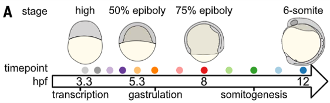

<style>
p.caption {
  font-size: 0.6em;
}
</style>

# Time Series Data

* data collected at different points in time(day1, day2, day3, day7......)

* some characteristics

  + potential for correlation between observations
  
  + regularly repeating pattern
  
```{r, out.width='85%', fig.align='center', echo=FALSE}

```

---

# Time Series Data

* data collected at different points in time(day1, day2, day3, day7......)

* some characteristics

  + potential for correlation between observations
  
  + regularly repeating pattern
  
```{r, out.width='100%', fig.align='center', echo=FALSE}
knitr::include_graphics('./image/JC0522/time_series2.png')
```

---

# Diffusion Map

* dimensionality reduction/feature extraction algorithm

---

# Diffusion Map: Dimensionality Reduction

```{r, out.width='100%', fig.align='center', echo=FALSE}

```

<br/>

.pull-left[
```{r, out.width='100%', fig.align='center', echo=FALSE}

```
]

.pull-right[

* raw data are sparse

* save computational resources

* visualization
]

<br/>

<p style="font-family: times, serif; font-size:11pt; font-style:italic">
Engel, D., Hüttenberger, L., & Hamann, B. (2012). A survey of dimension reduction methods for high-dimensional data analysis and visualization.
</p>

---

# Diffusion Map

* dimensionality reduction/feature extraction algorithm

* coordinates can be computed from the eigenvectors and eigenvalues of a diffusion operator on the data(non-linear version of PCA)

---

# Diffusion Map: non-linear version of PCA

PCA: creating new uncorrelated variables that successively maximize variance

.pull-left[
```{r, out.width='100%', fig.align='center', echo=FALSE}
knitr::include_graphics('./image/JC0522/difussion3.png')
```
]

.pull-right[

* picked first few eigenvectors and eigenvalues

* computed coordinates from them

* projected to those coordinates
]

<br/>

-> robust to noise perturbation

---

# Diffusion Map

* dimensionality reduction/feature extraction algorithm

* coordinates can be computed from the eigenvectors and eigenvalues of a diffusion operator on the data(non-linear version of PCA)

* the Euclidean distance between points in the embedded space is equal to the "diffusion distance" between probability distributions centered at those points


---

# Diffusion Map: Diffusion Framework

euclidean distance <-> difussion distance

.pull-left[
```{r, out.width='100%', fig.align='center', echo=FALSE}

```
]

.pull-right[
* running the chain forward in time geometric structure at larger and larger scales (the diffusion process)

* the notion of a cluster in the data set is quantified as a region in which the probability of escaping this region is low (within a certain time t)

* taking into account all linking between points, describing a global picture

]

---

# Diffusion Map

* dimensionality reduction/feature extraction algorithm

* coordinates can be computed from the eigenvectors and eigenvalues of a diffusion operator on the data(non-linear version of PCA)

* the Euclidean distance between points in the embedded space is equal to the "diffusion distance" between probability distributions centered at those points

* advantages:

  + robust to noise perturbation
  
  + emphasizing the concept of a cluster
  
  + computationally inexpensive

---

# Haghverdi 2016[2]: Model Design

* use Gaussians kernel to build the transition matrix

* use discrete random walks and graph searches to approximate the continuous process of diffusion

```{r, out.width='100%', fig.align='center', echo=FALSE}

```

```{r, out.width='90%', fig.align='center', echo=FALSE}

```

---

# Haghverdi 2016[2]: Results

* Simulation study of robustness:

  + 100 bootstrap data sets
  
  + Kendall-tau correlation of each two bootstrap data sets

```{r, out.width='60%', fig.align='center', echo=FALSE}
knitr::include_graphics('./image/JC0522/paper1res.png')
```

---

# Haghverdi 2016[2]: Results

* fig d: single-cell RNA (scRNA)-seq data of mouse  embryonic  stem  (ES)  cells  after leukemia inhibitory factor (LIF) withdrawal[3]

* fig f: an adult hematopoiesis scRNA-seq data set[4]

```{r, out.width='80%', fig.align='center', echo=FALSE}

```

---

# Farrell 2018[5]: Model Design

* use k-nearest-neighbor graph to build the transition matrix

* use discrete random walks and graph searches to approximate the continuous process of diffusion

```{r, out.width='100%', fig.align='center', echo=FALSE}

```

*"the walks are biased to only transitionto cells of equal or earlier pseudotime so thatwhen they reach developmental branch points,they proceed toward the root and do not explore other cell types"*

---

# Farrell 2018[5]: Results

* 38,731 cells; 694 embryos; 

* 12 closely spaced stages of early zebrafish development(high blastula stage -> six-somite stage)

```{r, out.width='100%', fig.align='center', echo=FALSE}

```

---

# Farrell 2018[5]: Results

```{r, out.width='80%', fig.align='center', echo=FALSE}

```

???
recapitulated the developmental trajectories expected from classical embryological studies; found out some new branches

---

# Farrell 2018[5]: Results

```{r, out.width='80%', fig.align='center', echo=FALSE}
knitr::include_graphics('./image/JC0522/paper2res3.png')
```

---

# Some Random Thoughts

* add pesudo-correlation within cells between different time point

* combine with RNA velocity -> a new embedded space

---

class: center, middle

## Thanks!

---

# References

```{r, load_refs, echo=FALSE,message=FALSE}
library(RefManageR)
bib <- ReadBib("./bibFiles/JC0522.bib", check = FALSE)
```

```{r, print_refs, results='asis', echo=FALSE, warning=FALSE, message=FALSE}
print(bib, 
  .opts = list(check.entries = FALSE, sorting = "none"))
```