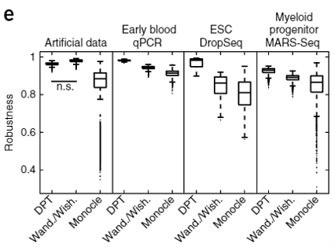

background diffusion matrix time-series data

connection

---

# Haghverdi 2016: Results

* Simulation study of robustness:

  + 100 bootstrap data sets
  
  + Kendall-tau correlation of each two bootstrap data sets

```{r, out.width='100%', fig.align='center', echo=FALSE}

```

---

# References

```{r, load_refs, echo=FALSE,message=FALSE}
library(RefManageR)
bib <- ReadBib("./bibFiles/JC0522.bib", check = FALSE)
```

```{r, print_refs, results='asis', echo=FALSE, warning=FALSE, message=FALSE}
print(bib, 
  .opts = list(check.entries = FALSE, sorting = "none"))
```