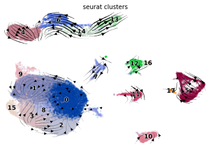
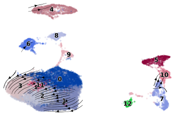
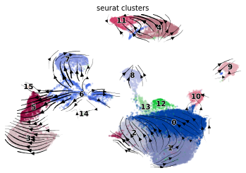
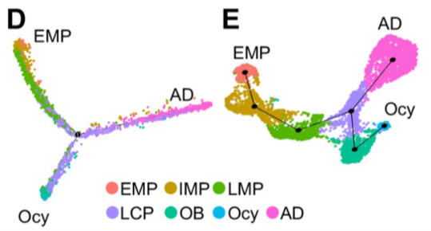

class: inverse, center, middle

# Giant Cell Tumor of Bone(GCTB)

---

# Recap

.pull-left[
```{r, out.width='100%', fig.align='center', echo=FALSE}
knitr::include_graphics('./image/LM0415/GCTB_bg1.png')
```
]

.pull-right[
* Benign bone tumor

* 3 Components:

  + Osteoclast-like multinucleated giant cells
  
  + Mononuclear macrophage. 
  
  + Spindle-shaped stromal cells
]

---

# Recap

* 5 samples: L56, L67, L70, L71, L77

* mutation: *H3F3A* -> Gly34Trp

```{r, out.width='120%', fig.align='center', echo=FALSE}
knitr::include_graphics('./image/LM0415/GCTB_bg2.png')
```

  + samples with mutation: L56, L70, L77
  
  + samples without mutation: L67, L71
  
---

# Trajectory

.pull-left[

With Mutation

```{r, out.width='100%', fig.align='center', echo=FALSE}

```

]

.pull-right[

Without Mutation

```{r, out.width='100%', fig.align='center', echo=FALSE}

```

]

---

# Trajectory

.pull-left[

```{r, out.width='100%', fig.align='center', echo=FALSE}

```

]

.pull-right[

```{r, out.width='100%', fig.align='center', echo=FALSE}

```

<p style="font-family: times, serif; font-size:11pt; font-style:italic">
Zhong, Leilei, et al. "Single cell transcriptomics identifies a unique adipose lineage cell population that regulates bone marrow environment."
</p>

]

<br/>

* original hypothesis: the mutation related to phenotype of different cell types -> related to GCTB development

* right now: analyze cells with/without mutation separately

