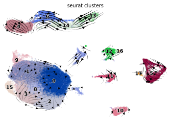

class: inverse, center, middle

# Giant Cell Tumor of Bone(GCTB)

---

# Recap

.pull-left[
```{r, out.width='100%', fig.align='center', echo=FALSE}
knitr::include_graphics('./image/LM0415/GCTB_bg1.png')
```
]

.pull-right[
* Benign bone tumor

* 3 Components:

  + Osteoclast-like multinucleated giant cells
  
  + Mononuclear macrophage. 
  
  + Spindle-shaped stromal cells
]

---

# Recap

* 5 samples: L56, L67, L70, L71, L77

* mutation: *H3F3A* -> Gly34Trp

```{r, out.width='120%', fig.align='center', echo=FALSE}
knitr::include_graphics('./image/LM0415/GCTB_bg2.png')
```

  + samples with mutation: L56, L70, L77
  
  + samples without mutation: L67, L71
  
---

# Trajectory

.pull-left[

With Mutation

```{r, out.width='100%', fig.align='center', echo=FALSE}

```

]

.pull-right[

Without Mutation

```{r, out.width='100%', fig.align='center', echo=FALSE}
knitr::include_graphics('./image/LM0610/GCTB_wtoMut.png')
```

]

---

# Trajectory

.pull-left[

```{r, out.width='100%', fig.align='center', echo=FALSE}
knitr::include_graphics('./image/LM0610/GCTB_res.png')
```

]

.pull-right[

```{r, out.width='100%', fig.align='center', echo=FALSE}
knitr::include_graphics('./image/LM0610/GCTB_ref.png')
```

<p style="font-family: times, serif; font-size:11pt; font-style:italic">
Zhong, Leilei, et al. "Single cell transcriptomics identifies a unique adipose lineage cell population that regulates bone marrow environment."
</p>

]

* similarity between cluster 2 and lmp

  +  maintaining marrow vasculature & suppressing bone formation

* original hypothesis: the mutation related to phenotype of different cell types -> related to GCTB development

* current strategy: analyze cells with/without mutation separately

---

class: inverse, center, middle

# DCATS

---

# Package Development

Overview

```{r, out.width='100%', fig.align='center', echo=FALSE}
knitr::include_graphics('./image/LM0610/DCATS_pkg.png')
```

---

# Package Development

(1) README.md

```{r, out.width='80%', fig.align='center', echo=FALSE}

```

---

# Package Development

(1) README.md

```{r, out.width='100%', fig.align='center', echo=FALSE}

```

---

# Package Development

(2) DESCRIPTION

For installed package:

* Loading: 

  + available in memory <br>
  + can be access using `::`
  
* Attaching:

  + need to be loaded first <br>
  + done through `library()` or `require()` <br>
  + `search()` can be used to check attached packages
  
---

# Package Development

(2) DESCRIPTION
  
In `DESCRIPTION` file:

* Imports:

  + packages listed are installed when install this package
  + functions from those packages are used as `pkg::fun()`
  
* Depends:

  + packages listed are attached when this package is attached
  + functions can used directly through `fun()`
  
* Suggests:

  + this package can use these packages, but doesn’t require them
  + these packages only are used in one/few functions
  
---

# Package Development

(2) DESCRIPTION

```{r, out.width='80%', fig.align='center', echo=FALSE}

```

---

# Package Development

(3) NAMESPACE

```{r, out.width='90%', fig.align='center', echo=FALSE}

```

---

# Package Development

(4) R folder

```{r, out.width='100%', fig.align='center', echo=FALSE}

```

---

# Package Development

(4) R folder

```{r, out.width='90%', fig.align='center', echo=FALSE}

```

---

# Package Development

(4) R folder

```{r, out.width='70%', fig.align='center', echo=FALSE}

```

---

# Package Development

(5) data folder

* use `usethis::use_data([data object], [data name], internal = TRUE)` to generate

* data can be load through `load([data name])`

```{r, out.width='90%', fig.align='center', echo=FALSE}

```

---

# Package Development

(5) man folder

```{r, out.width='90%', fig.align='center', echo=FALSE}

```

---

# Package Development

(5) man folder

```{r, out.width='75%', fig.align='center', echo=FALSE}

```

---

# Package Development

(5) man folder

```{r, out.width='90%', fig.align='center', echo=FALSE}

```

---

# Package Development

(5) test folder

* help us to do testing automatically

* based on the `testthat` package

* generate through `usethis::use_testthat()`

  + create a `tests/testthat` directory
  + Adds testthat to the `Suggests` field in the `DESCRIPTION`
  + Creates a file `tests/testthat.R` that runs all your tests when `R CMD check` runs

```{r, out.width='80%', fig.align='center', echo=FALSE}

```

---

# Package Development

(5) test folder

* test files should under the `tests/testthat/` folder

* test files should start with `test`

* testing process should be finished in a short time

```{r, out.width='80%', fig.align='center', echo=FALSE}

```

---

# Package Development

* updated functions
* cleaned unnecessary files
* added example
* added test file
* added sample data
* added documentation
* repeat: test <-> debug

more information related to package development: [R Packages](https://r-pkgs.org/index.html)

---

# New Function: dcats_GLM

```{r, out.width='90%', fig.align='center', echo=FALSE}

```

---

class: center, middle

## Thanks!

---

# Real World data: David 2018

.pull-left[
```{r, out.width='90%', fig.align='center', echo=FALSE}

```
]

.pull-right[

* 8 time points: 0-30 days

* filtered out cell numbers lower than 10 in more than 2 time point

* only glia is true positive

* consider combining different cell types into a larger group
]

<p style="font-family: times, serif; font-size:11pt; font-style:italic">
Davie, Kristofer, et al. "A single-cell transcriptome atlas of the aging Drosophila brain." Cell 174.4 (2018): 982-998.
</p>