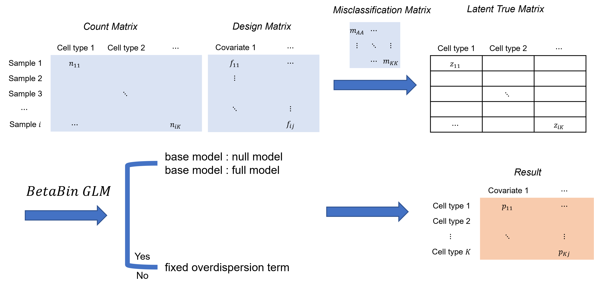
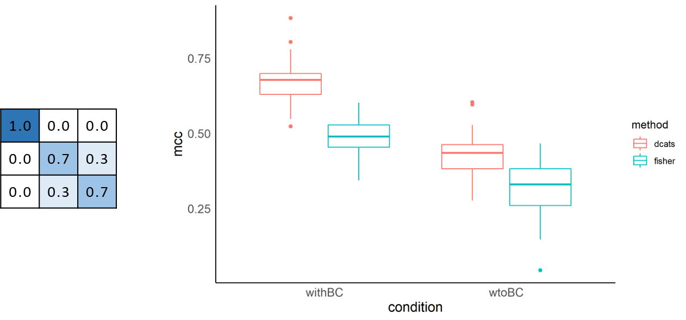

# Workflow

```{r, out.width='100%', fig.align='center', echo=FALSE}

```

Two main hypotheses:

* the clustering step is often inaccurate and may be systematically biased

* the reads counts follow beta-binomial distribution 

---

# Bias Correction

\begin{bmatrix}
    m_{AA}       & m_{AB} & \dots & m_{AK} \\
    m_{BA}       & m_{BB} & \dots & m_{BK} \\
    \vdots & \vdots & \ddots & \vdots \\
    m_{KA}       & m_{KB} & \dots & m_{KK}
\end{bmatrix}

$m_{ij}$ denotes the probability of a cell $c$ in type $i$ be assigned to type $j$ by the clustering method

Two procedures:

* Expectation–maximization(EM) algorithm

* Sampling based on the true proportion vector

---

# Expectation–maximization(EM) Algorithm

an approach for maximum likelihood estimation in the presence of latent variables

$$l(\theta,\mathbf{Y}) = l(\theta, Y_{obs}, Z)$$

* E-Step: Estimate the missing variables in the dataset.

$$Q(\theta, \theta^{(t)}) = Ez[l(\theta, Y_{obs}, Z)|Y_{obs}, \theta^{(t)}]$$

* M-Step: Maximize the parameters of the model in the presence of the data.

$$\theta^{(t+1)} = arg\,max_{\theta}\,Q(\theta, \theta^{(t)})$$

---

# Bias Correction: EM Part

$$\begin{split}
		\mathcal{L(\mu)} & = P(x | \mu, M)
		= \prod_{j=1}^{K} \prod_{c=1}^{x_j} \left[\sum_{i=1}^{K} P(I_c=i|\mu) P(A_c=j|I_c=i) \right]\\
		& =  \prod_{j=1}^{K} \prod_{c=1}^{x_j} \left[ \sum_{i=1}^{K} \mu_i m_{i,j} \right] 
		= \prod_{j=1}^{K} \left[ \sum_{i=1}^{K} \mu_i m_{i,j} \right]^{x_j} 
	\end{split}$$

$\mu$ denotes unknown cell type composition vector, $x$ denotes observing cell counts vector

$$z_{i,j} = P(I_c=j|A_c=i) = 
	\frac{P(A_c=i|I_c=j)P(I_c=j|\mu)}
	{\sum_{t=1}^{K} P(A_c=i|I_c=t)P(I_c=t|\mu)}
	= \frac{m_{j,i} \mu_j}{\sum_{t=1}^{K} m_{t,i}\mu_t}$$

Through maximize $log\,\mathcal{L(z)}$, we can get $$\mu_j = \frac{\sum_{i=1}^{K}z_{i,j} x_i}{\sum_{t=1}^{K}\sum_{i=1}^{K}z_{i,t} x_i}$$

---

# Bias Correction: Sampling Process

$$g_{i} \sim Multinomial(\mu, M)$$

$g_{i}$ denotes the $i$th sampled vector following multinomial distribution with size $\mu$ and probability $M$

---

# Generalized Linear Models (GLMs)

Simple Linear Regression:

$$E(Y) = \beta_0 + \beta\mathbf{X}$$

* Random component: $Y$

* Systematic component: $\mathbf{X}$

* Link function: $E(Y_i)$

<br/>

Generalized Linear Models:

$$g(\mu) = \beta_0 + \beta\mathbf{X}$$

---

# Model: Betabin GLM

A beta-binomial distirbution:

$$P(Y=y|n,p) = \left(\begin{array}{c}n \\y \end{array} \right) = p^y(1-p)^{n-y}$$
$$f(p|a,b) = \frac{1}{B(a,b)}p^{a-1}(1-p)^{b-1}$$

$$E(Y|n,a,b) = E[E(Y|n,a,b,p)] = \frac{na}{a+b}$$

$$Var(Y|n,a,b) = E[Var(Y|n,a,b,p)] + Var[E(Y|n,a,b,p)] = \frac{nab(a+b+n)}{(a+b)^2(a+b+1)}$$
Let $$\pi = \frac{a}{a+b}, \phi = \frac{1}{a+b+1}$$then $$E(Y|n,\pi,\phi) = n\pi, Var(Y|n,\pi,\phi) = n\pi(1-\pi)[1+(n-1)\times\phi]$$

---

# Model: Likelihood Ratio Test

---

# Theoretical Simulation

```{r, out.width='100%', fig.align='center', echo=FALSE}

```

---

# scRNA-seq Simulation

```{r, out.width='90%', fig.align='center',echo=FALSE}
knitr::include_graphics('./image/RPG_discussion/dcats_result2.png')
```

---

# Real World Data Analysis

Give consistent conclusions as original papers[2,3]
  
```{r, out.width='100%', fig.align='center',echo=FALSE}
knitr::include_graphics('./image/LM0415/DCATS_fig1C.png')
```
