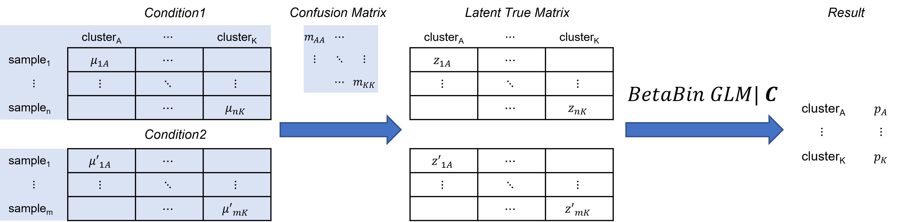
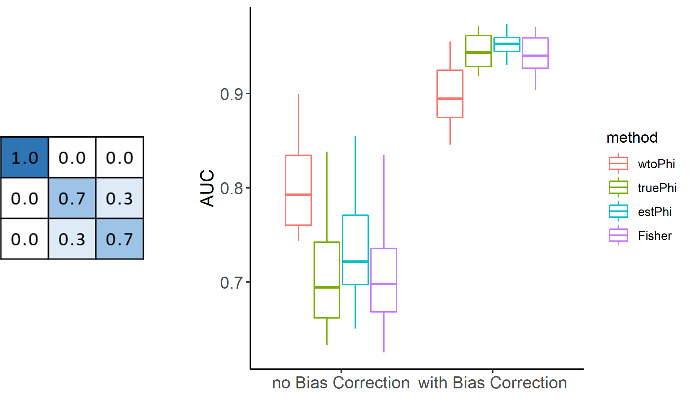
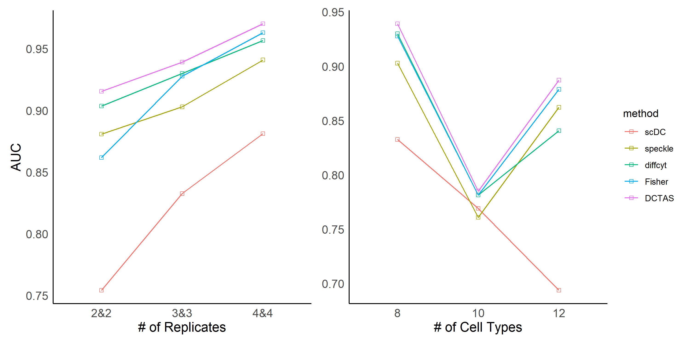
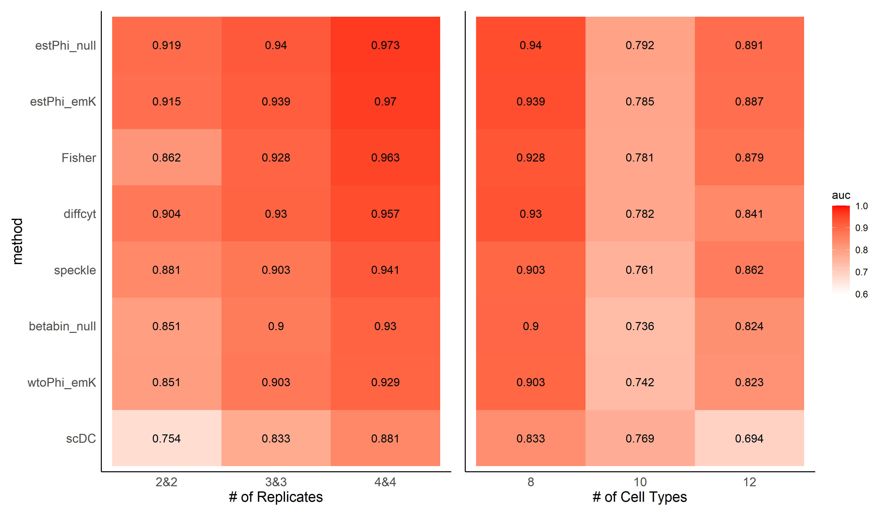
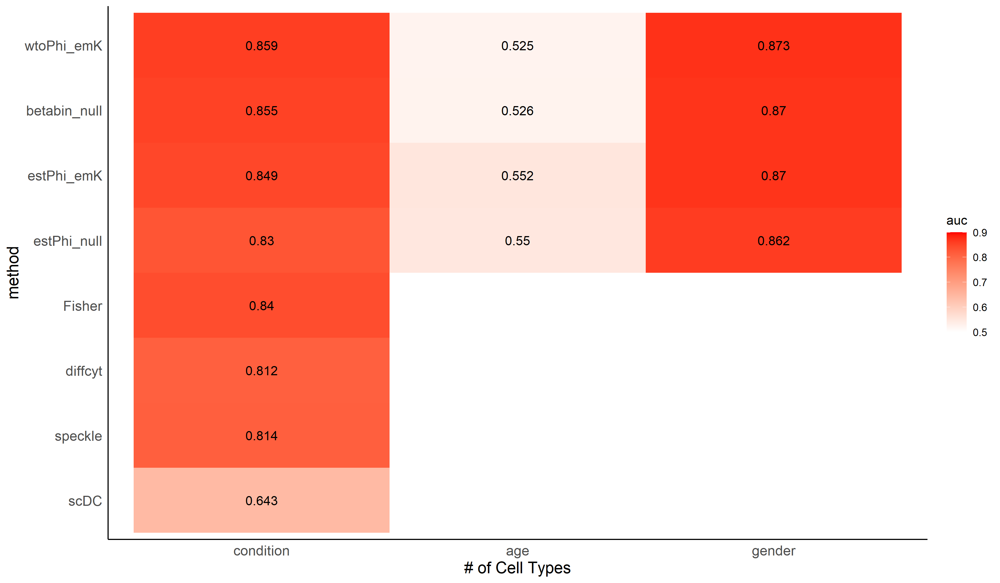
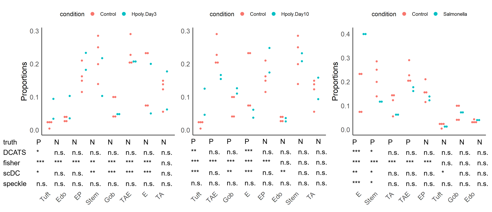
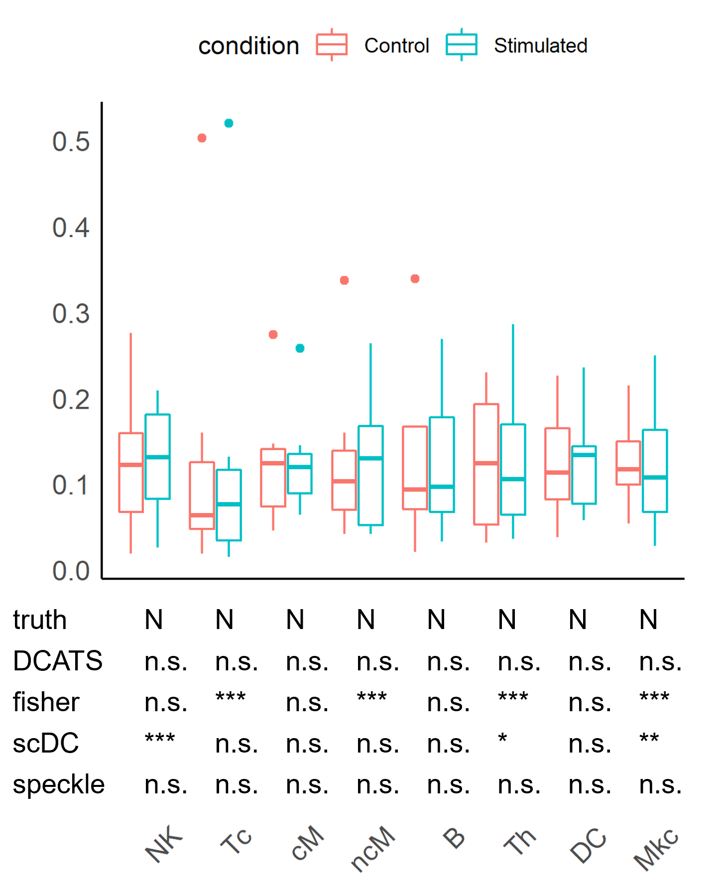

# Workflow: previous version

```{r, out.width='100%', fig.align='center', echo=FALSE}

```

---

# Workflow

```{r, out.width='100%', fig.align='center', echo=FALSE}
knitr::include_graphics('./image/LM0510/overall.png')
```

---

# Generalized Linear Models (GLMs)

Simple Linear Regression:

$$E(Y) = \beta_0 + \beta\mathbf{X}$$

where $y$ follows normal distribution.

<br/>

Generalized Linear Models:

$$g(\bar y) = \beta_0 + \beta\mathbf{X}$$

where $y$ follows other distribution including binomial distribution, poisson distribution.

---

# Base Model

* Type 1: Null model

Model 0: $g(\bar y) = \beta_0$

Model 1: $g(\bar y) = \beta_0 + \beta_1*tested\_covariate$

<br/>

* Type 2: Full model

Model 0: $g(\bar y) = \beta_0 + \beta*other\_covariates$

Model 1: $g(\bar y) = \beta_0 + \beta*other\_covariates + \beta_i*tested\_covariate$

---

# Model: Betabin GLM

A beta-binomial distirbution:

$$P(Y=y|n,p) = \left(\begin{array}{c}n \\y \end{array} \right) = p^y(1-p)^{n-y}$$
$$f(p|a,b) = \frac{1}{B(a,b)}p^{a-1}(1-p)^{b-1}$$

$$E(Y|n,a,b) = E[E(Y|n,a,b,p)] = \frac{na}{a+b}$$

$$Var(Y|n,a,b) = E[Var(Y|n,a,b,p)] + Var[E(Y|n,a,b,p)] = \frac{nab(a+b+n)}{(a+b)^2(a+b+1)}$$
Let $$\pi = \frac{a}{a+b}, \phi = \frac{1}{a+b+1}$$then $$E(Y|n,\pi,\phi) = n\pi, Var(Y|n,\pi,\phi) = n\pi(1-\pi)[1+(n-1)\times\phi]$$

---

# Over-dispersion term

* Without fixed over-dispersion term : 

   + $\phi$ is estimated in each beta-binomial GLM for each cell type
   
<br/>

* With fixed over-dispersion term : 

   + $\phi$ is estimated across all cell types before testing
   
   + is given in each beta-binomial GLM for each cell type

---

# Simulation Design

```{r, out.width='90%', fig.align='center',echo=FALSE}
knitr::include_graphics('./image/LM0510/dcats_simAll.png')
```

---

# Theoretical Simulation

```{r, out.width='100%', fig.align='center', echo=FALSE}

```

---

# Simulation with transcriptomics

```{r, out.width='100%', fig.align='center', echo=FALSE}

```

---

# Simulation with transcriptomics

```{r, out.width='100%', fig.align='center', echo=FALSE}

```

---

# Simulation with covariates

* 10 samples for each condition 

* 8 cell types

* three covariates: condition, age, gender

   + condition: (6, 6, 10, 10, 8, 8, 8, 8) vs (8, 8, 8, 8, 8, 8, 8, 8)
   
   + age: (-0.05, 0, 0, 0.05, 0.05, 0, 0, -0.05) for one unit increase in age
   
   + gender: (-2, 2, 0, 0, -2, 2, 0, 0) for male versus female
   
   + additive effect
   
---

# Simulation with covariates

```{r, out.width='100%', fig.align='center', echo=FALSE}

```

---

# Real world data 1

```{r, out.width='100%', fig.align='center', echo=FALSE}

```

<p style="font-family: times, serif; font-size:11pt; font-style:italic">
Haber, Adam L., et al. "A single-cell survey of the small intestinal epithelium." Nature 551.7680 (2017): 333-339.
</p>

---

# Real world data 2

```{r, out.width='50%', fig.align='center', echo=FALSE}

```

<p style="font-family: times, serif; font-size:11pt; font-style:italic">
Kang, Hyun Min, et al. "Multiplexed droplet single-cell RNA-sequencing using natural genetic variation." Nature biotechnology 36.1 (2018): 89-94.
</p>

