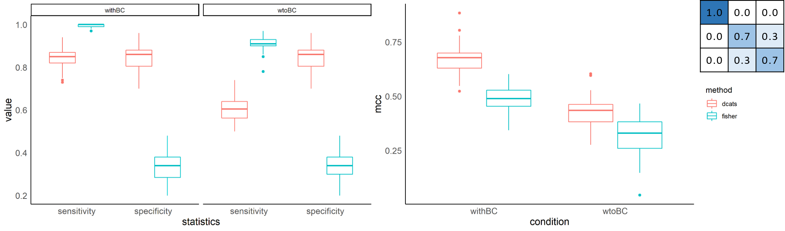
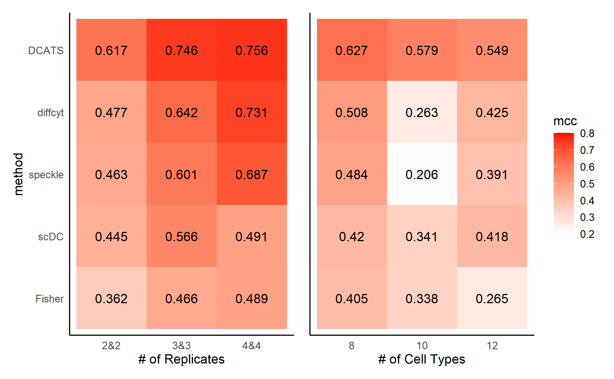
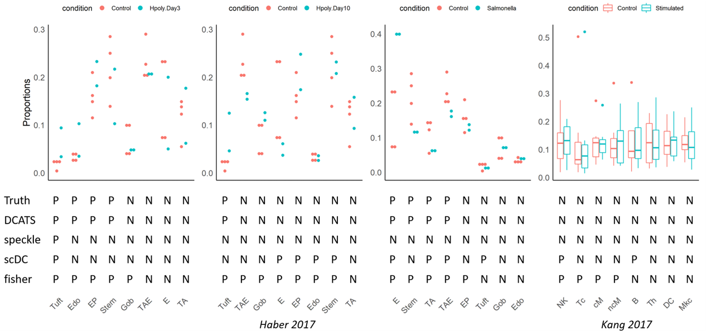
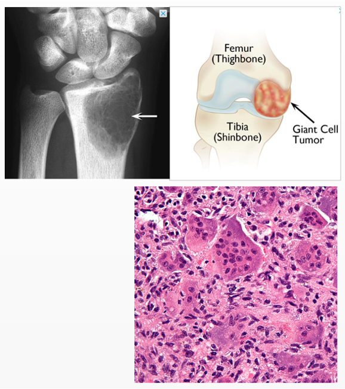
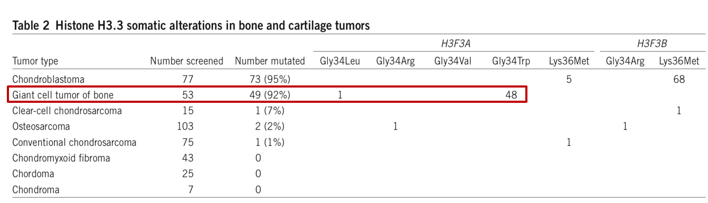
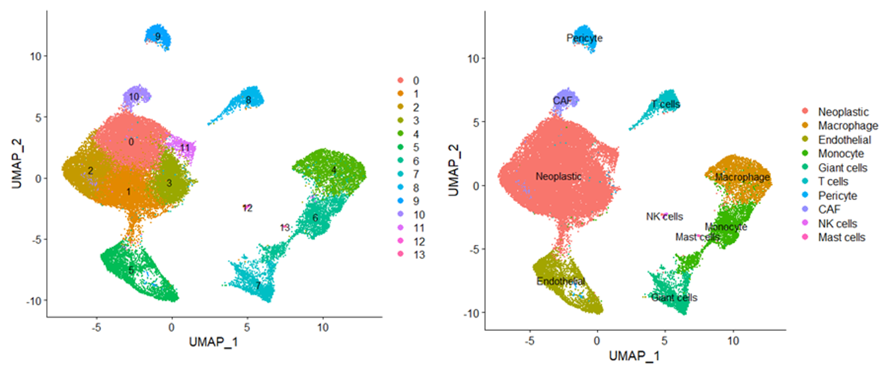
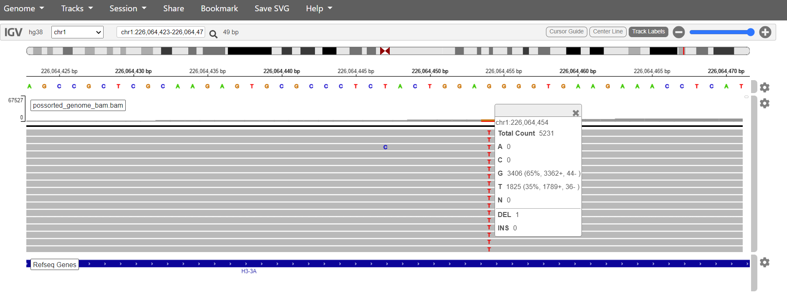
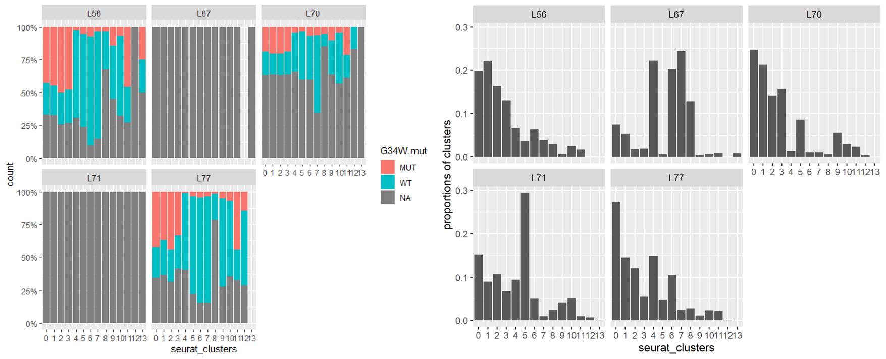
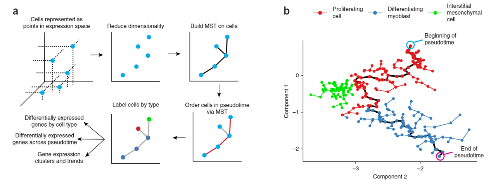
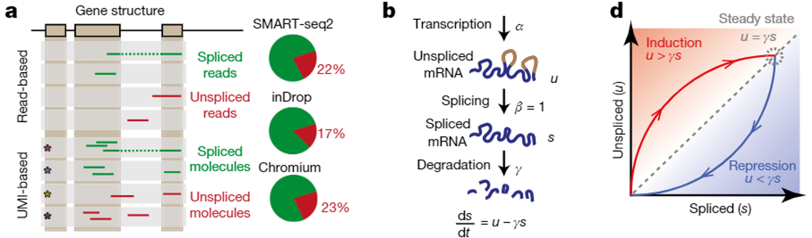

class: inverse, center, middle

# DCATS

---

# Theoretical Simulation

```{r, out.width='100%', fig.align='center', echo=FALSE}

```

---

# scRNA-seq Simulation

```{r, out.width='90%', fig.align='center',echo=FALSE}

```

---

# Real World Data

```{r, out.width='100%', fig.align='center',echo=FALSE}

```

---
class: inverse, center, middle

# Giant Cell Tumor of Bone(GCTB)

---

# Background

.pull-left[
```{r, out.width='100%', fig.align='center', echo=FALSE}

```
]

.pull-right[
* Benign bone tumor

* 3 Components:

  + Osteoclast-like multinucleated giant cells
  
  + Mononuclear macrophage. 
  
  + Spindle-shaped stromal cells
]

---

# Background

```{r, out.width='120%', fig.align='center', echo=FALSE}

```

Stromal Cells are neoplastic Cells in GCTB

* H3.3G34W mutation were found in 90% GCTB[1]

* The mutation were only found in the stromal component of GCTB

* Stromal cells proliferate indefinitely 

* Stromal cells can generate tumor in vivo

---

# Basic Information

* 5 samples: L56, L67, L70, L71, L77

```{r, out.width='120%', fig.align='center', echo=FALSE}

```

---

# Validate this mutation: IGV

```{r, out.width='120%', fig.align='center', echo=FALSE}

```

* reference genome: hg38

* chr1:226,064,454 G->T

* not all samples have this mutation

  + L56: G(71%), T(29%); L70: G(65%), T(35%); L77: G(79%), T(21%)
  
  + L67: G(100%); L71: G(100%)

---

# Validate this mutation: cellSNP

[cellSNP](https://pypi.org/project/cellSNP/): genotyping cells

* Mode 1: pileup a list of SNPs for a single BAM/SAM file

* Mode 2: pileup whole chromosome(s) for a single BAM/SAM file(bulk and scRNA-seq)

* Mode 3: pileup a list of SNPs for one or multiple BAM/SAM files

```{r, out.width='120%', fig.align='center', echo=FALSE}

```

---

# Trajectory Analysis

Monocle: based on similarity of different cell clusters[2]

```{r, out.width='120%', fig.align='center', echo=FALSE}

```


---

# Trajectory Analysis

Velocyto: nascent (unspliced) vs mature (spliced) mRNA[3]

* steady-state model(gene level):

```{r, out.width='120%', fig.align='center', echo=FALSE}

```


---

# References

```{r, load_refs, echo=FALSE,message=FALSE}
library(RefManageR)
bib <- ReadBib("./bibFiles/LM0415.bib", check = FALSE)
```

```{r, print_refs, results='asis', echo=FALSE, warning=FALSE, message=FALSE}
print(bib, 
  .opts = list(check.entries = FALSE, sorting = "none"))
```

